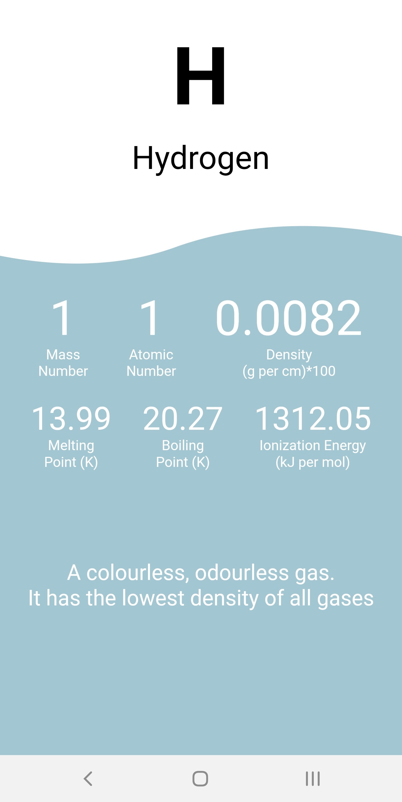

# Offline Periodic Table

An offline version of the periodic table, made with Flutter.

## Current Features
[✓] Beautiful animation between pages

[✓] Information about each element

[✓] 18 names groups

[✓] Homepage

[✓] Element details page

[✓] Well-designed UI

## TODO List

᛫ Add remaning elements to the dataset (Transition metals remaining)

# Screenshots

 
